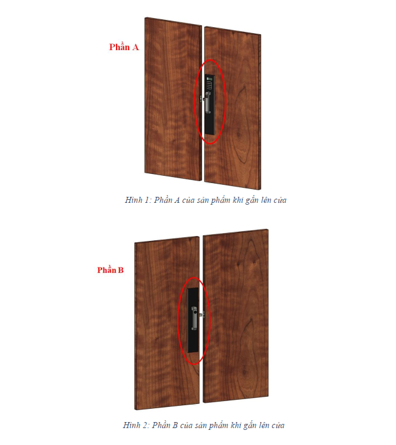
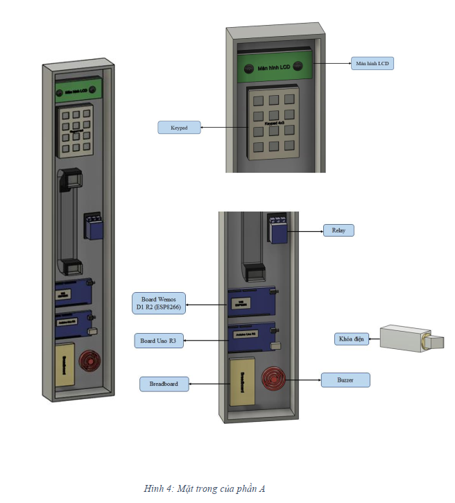
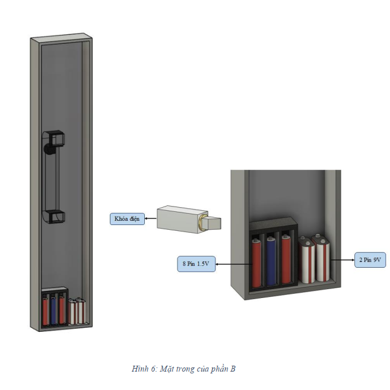
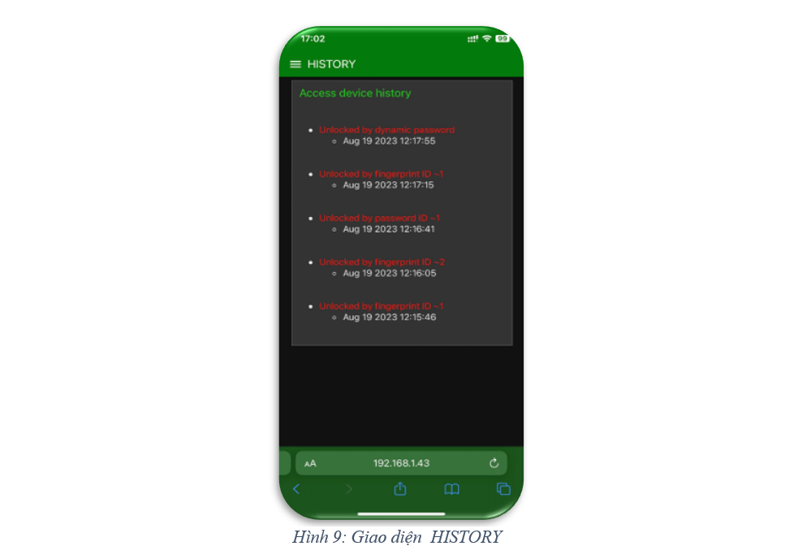

# Dự án Khóa cửa thông minh - IOT

## Tổng quan
Dự án này liên quan đến việc thiết kế và triển khai hệ thống khóa cửa thông minh, có thể được điều khiển bằng nhiều phương pháp như nhận diện vân tay, nhập mật mã và truy cập từ xa qua giao diện website.

## Thành viên Nhóm (đến từ 21CLC - HCMUS)
- **Nguyễn Minh Quân (Nhóm trưởng)**
- **Doãn Anh Khoa**
- **Phạm Sĩ Phú**

## Mục lục
1. [Tổng quan Dự án](#tổng-quan)
2. [Tính năng](#tính-năng)
3. [Kiến trúc Hệ thống](#kiến-trúc-hệ-thống)
4. [Thiết kế 3D](#thiết-kế-3d)
5. [Giao diện Website](#giao-diện-web)
6. [Giải thích NodeRED Flow](#giải-thích-nodered-flow)
7. [Tài liệu tham khảo](#tài-liệu-tham-khảo)

## Tính năng
### Tính năng của thiết bị vật lý
- **Mở khóa thủ công**: Mở khóa cửa từ bên trong bằng nút nhấn.
- **Màn hình LCD**: Hiển thị tin nhắn và thông tin trạng thái.
- **Cảm biến vân tay**: Mở khóa cửa bằng cách sử dụng vân tay đã đăng ký.
- **Bàn phím**: Mở khóa cửa bằng cách nhập mật mã số.
- **Chức năng quản lý**: Thêm hoặc xóa mật mã và vân tay thông qua bàn phím.
- **Cảnh báo an ninh**: Kêu báo động sau 5 lần truy cập thất bại, khóa hệ thống trong 2 phút và gửi thông báo khẩn cấp đến chủ nhà.

### Tính năng của Web và Cloud
- **Xác thực người dùng**: Đăng nhập vào giao diện web với thông tin đã xác định trước.
- **Trạng thái thiết bị**: Hiển thị trạng thái thiết bị và nhật ký truy cập gần đây.
- **Mật mã tạm thời**: Tạo mật mã tạm thời cho khách có thể mở khóa.
- **Mở khóa từ xa**: Mở khóa cửa từ xa qua giao diện web.
- **Lưu trữ dữ liệu**: Lưu trữ nhật ký truy cập và dữ liệu người dùng trên cloud.

## Kiến trúc Hệ thống

### Luồng dữ liệu
1. **Mạch Arduino Uno**: Giao tiếp với mạch Wemos và LCD, Keypad, Button, Cảm biến vân tay.
2. **Mạch Wemos**: Kết nối với Buzzer, Relay; kết nối Wi-Fi và giao tiếp với broker MQTT.
3. **Buzzer**: Nhận tín hiệu số từ bo mạch Wemos.
4. **Relay và khóa điện**: Relay điều khiển khóa điện tử dựa trên tín hiệu từ bo mạch Wemos.
5. **Màn hình LCD**: Hiển thị tin nhắn trạng thái và được điều khiển bởi Arduino Uno.
6. **Bàn phím**: Gửi ký tự đầu vào đến Arduino Uno.
7. **Nút nhấn**: Mạch Uno nhận tín hiệu digital từ nút nhấn.
8. **Cảm biến vân tay**: Giao tiếp với Arduino Uno để nhận diện vân tay.
9. **Broker MQTT**: Hỗ trợ giao tiếp giữa mạch Wemos và web server.
10. **NodeRED**: GIao tiếp với MQTT, quản lý luồng dữ liệu và tương tác với IFTTT để gửi thông báo.
11. **Cloud (ThinkSpeak.com)**: Truyền nhận dữ liệu vói server.

## Thiết kế 3D

## Giao diện Web
### Đăng nhập và Đăng xuất

- **Đăng Nhập**: Cho phép quản trị viên đăng nhập vào giao diện web.
- **Đăng Xuất**: Đăng xuất người dùng khỏi giao diện web một cách an toàn.

### Tab trang chủ

- Hiển thị thông tin cơ bản về thiết bị và phương thức truy cập gần nhất.

### Tab lịch sử

- Hiển thị lịch sử truy cập, bao gồm phương thức và thời gian.

### Tab bảo mật

- **Mật mã tạm thời**: Tạo mật mã tạm thời cho khách.
- **Mở khóa từ xa**: Mở khóa cửa từ xa bằng cách nhập mật mã quản trị viên.

## Các Flow của NodeRED
1. **Đăng nhập Website**: Luồng xác thực người dùng.
2. **Thông tin Thiết Bị**: Luồng hiển thị trạng thái thiết bị.
3. **Lịch Sử Truy Cập**: Luồng hiển thị nhật ký truy cập.
4. **Tạo Mật Mã Tạm Thời**: Luồng tạo và quản lý mật mã tạm thời.
5. **Mở Khóa Từ Xa**: Luồng mở khóa cửa từ xa.

## Tài Liệu Tham Khảo
- [Làm khóa vân tay đơn giản dùng cảm biến vân tay r305 và kít arduino nano](https://www.youtube.com/watch?v=b1DIAH9GfWA)
- [How to make fingerprint door lock at home](https://www.youtube.com/watch?v=SMmj_qAbyeM)
- [Arduino Keypad and LCD display](https://www.youtube.com/watch?v=G2C6_Bp8cwk)
- [Hướng dẫn giao tiếp uart giữa board arduino với kít wifi esp8266](https://www.youtube.com/watch?v=X7CKYdUB2mw)
- [Node-Red Dashboard tutorial](https://www.youtube.com/playlist?list=PLhaePTb701HSHPp6r3lbWdnUs8y98OHh)
- [How to catch time in Node-Red](https://youtu.be/ZcekM0kpg4Y)
- [Code kết nối Wifi](https://dandelion-croissant-ad4.notion.site/Code-k-t-n-iWifi-tr-n-Wokwi-4055feb3a4844e56914a3ae5bff8a82a)
- [Code kết nối MQTT Server](https://dandelion-croissant-ad4.notion.site/Codek-t-n-i-MQTT-Server-b708e215b4134638ae1eafe37a7650aa)
- [Code gửi Http Request từ ESP](https://dandelion-croissantad4.notion.site/Code-g-i-HttpRequest-t-ESPfa27af5c3b0e4750b7d7e8dd1d81a6c3)
